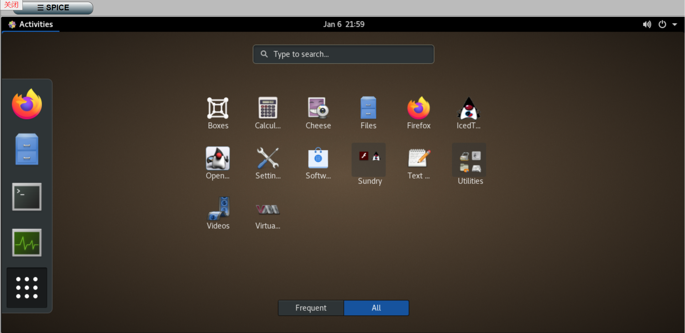

## 关于EVCloud

> EVCloud是一个轻量级云主机管理平台，追求功能实用，运行稳定，维护简单。
主要技术栈：CEPH、MariaDB、Django、libvirt。

### 展示





## 环境搭建(CentOS9)
### 1 安装python和Git
请自行安装python3.9和Git。
使用Git拉取代码： 
```
git clone https://github.com/evcloud/evcloud.git
```
### 2 安装python运行环境
#### （1） 使用python虚拟环境
使用pip命令安装pipenv。  
```
pip3 install pipenv
```
在代码工程根目录下，即文件Pipfile同目录下运行命令：  
```
pipenv install
```
#### （2） 使用系统python环境
在代码工程根目录下，即文件requirements.txt同目录下运行命令：  
```pip3 install -r requirements.txt```

如果通过pip安装过程中安装libvirt-python失败，使用下面命令安装。
```
dnf uninstall python3-libvirt.x86_64

# 如果使用了虚拟python环境，libvirt_python复制到你的虚拟python环境
cp /usr/lib64/python3.9/site-packages/libvirt* /root/.local/share/virtualenvs/evcloud-b1zsp8qp/lib/python3.9/site-packages/ -r
```

### 3 安全敏感信息配置文件
安全信息配置demo文件security_demo.py修改文件名为security.py，根据自己情况完成配置。

### 4 数据库安装
请自行安装mysql数据库，根据自己的情况修改security.py文件中数据库的配置项。 
  ```
DATABASES = {
    'default': {
        'ENGINE': 'django.db.backends.mysql',  # 数据库引擎
        'NAME': 'xxx',  # 数据的库名，事先要创建之
        'HOST': '127.0.0.1',  # 主机
        'PORT': '3306',  # 数据库使用的端口
        'USER': 'xxx',  # 数据库用户名
        'PASSWORD': 'xxx',  # 密码
        'OPTIONS': {'init_command': "SET sql_mode='STRICT_TRANS_TABLES'"}
    },
}
```   

### 5 CEPH依赖库安装
根据自己ceph版本安装对应版本的包，与ceph的通信默认使用官方librados的python包python3-rados，python3-rbd的rpm包安装成功后，python包会自动安装到
系统python3第三方扩展包路径下（/usr/lib64/python3.9/site-packages/）。    
使用python虚拟环境的，需要手动把路径下的python包文件rados*和rbd*复制到你的虚拟python环境*/site-packages/下。
```
dnf install librados-devel.x86_64 -y
dnf install python3-rados.x86_64 -y
dnf install python3-rbd.x86_64 -y

# 如果使用了虚拟python环境，rados*和rbd*复制到你的虚拟python环境
cp /usr/lib64/python3.9/site-packages/rados* /root/.local/share/virtualenvs/evcloud-b1zsp8qp/lib/python3.9/site-packages/ -r    
cp /usr/lib64/python3.9/site-packages/rbd* /root/.local/share/virtualenvs/evcloud-b1zsp8qp/lib/python3.9/site-packages/ -r
```

### 6 运行服务
如果使用python虚拟环境，先激活python虚拟环境  
```
pipenv shell
```    
数据库迁移,在项目根目录下运行如下命令完成数据库迁移。  
```
python3 manage.py migrate
```
运行web服务  
```
python3 manage.py runserver 0:80
```   
如果一切正常，打开浏览器输入url(主机IP, 如：127.0.0.1)即可查看站点;

### 7 远程console服务（NoVNC和Spice）
安装websockify
```
pip3 install websockify
```
替换websockify的token插件，使用项目中自定义的token插件，根据自己环境修改以下命令中的PROJECT_PATH和PYTHON_PATH：
```
ln -s PROJECT_PATH/novnc/token_plugin_mysql/token_plugin_mysql.py PYTHON_PATH/python3.9/site-packages/websockify/token_plugins.py
```
WEB console客户端noVNC（https://github.com/novnc/noVNC）和 spice-html5（https://gitlab.freedesktop.org/spice/spice-html5） 在项目目录static/console下。

启动websockify服务
运行01run_novnc.sh脚本，或直接执行命令：
```
websockify 0.0.0.0:84 --daemon --web=/home/uwsgi/evcloud/static/console --token-plugin=TokenMysql --token-source='mysql'
```
请对应设置项目配置文件settings.py中参数NOVNC_SERVER_PORT的值。

### 8 nginx
使用nginx时，可以参考django_site目录下nginx_evcloud.conf文件。


## 后台管理和配置
### 1 系统镜像和硬盘
虚拟机系统镜像和虚拟硬盘使用Ceph的rbd块存储；  
前提条件：要求已经在后台添加了一个分中心，添加了ceph集群配置和存储系统镜像的ceph存储池pool；   
要添加一个系统镜像，首先添加一个对应系统镜像内的操作系统类型的虚拟机的xml模板，以一个镜像为Linux系统（如CentOS、ubuntu等）virtio驱动xml模板为例,
模板中的形如"{xxx}"的内容是各对应配置的占位符，在创建虚拟机时会填充用户选择的配置参数。
```xml
<domain type='kvm'>
  <name>{name}</name>
  <uuid>{uuid}</uuid>
  <memory unit='MiB'>{mem}</memory>
  <currentMemory unit='MiB'>{mem}</currentMemory>
  <vcpu placement='static'>{vcpu}</vcpu>
  <os>
    <type arch='x86_64' machine='pc-i440fx-rhel7.0.0'>hvm</type>
    <bootmenu enable='yes'/>
  </os>
  <features>
    <acpi/>
    <apic/>
  </features>
  <cpu mode='custom' match='exact' check='partial'>
    <model fallback='allow'>Haswell</model>
  </cpu>
  <clock offset='utc'>
    <timer name='rtc' tickpolicy='catchup'/>
    <timer name='pit' tickpolicy='delay'/>
    <timer name='hpet' present='no'/>
  </clock>
  <on_poweroff>destroy</on_poweroff>
  <on_reboot>restart</on_reboot>
  <on_crash>destroy</on_crash>
  <pm>
    <suspend-to-mem enabled='no'/>
    <suspend-to-disk enabled='no'/>
  </pm>
  <devices>
    <emulator>/usr/libexec/qemu-kvm</emulator>
    <disk type='network' device='disk'>
      <driver name='qemu'/>
      <auth username='admin'>
        <secret type='ceph' uuid='{ceph_uuid}'/>
      </auth>
      <source protocol='rbd' name='{ceph_pool}/{diskname}'>
        {ceph_hosts_xml}
      </source>
      <target dev='vda' bus='virtio'/>
      <boot order='1'/>
      <address type='pci' domain='0x0000' bus='0x00' slot='0x08' function='0x0'/>
    </disk>
    <controller type='usb' index='0' model='ich9-ehci1'>
      <address type='pci' domain='0x0000' bus='0x00' slot='0x05' function='0x7'/>
    </controller>
    <controller type='usb' index='0' model='ich9-uhci1'>
      <master startport='0'/>
      <address type='pci' domain='0x0000' bus='0x00' slot='0x05' function='0x0' multifunction='on'/>
    </controller>
    <controller type='usb' index='0' model='ich9-uhci2'>
      <master startport='2'/>
      <address type='pci' domain='0x0000' bus='0x00' slot='0x05' function='0x1'/>
    </controller>
    <controller type='usb' index='0' model='ich9-uhci3'>
      <master startport='4'/>
      <address type='pci' domain='0x0000' bus='0x00' slot='0x05' function='0x2'/>
    </controller>
    <controller type='pci' index='0' model='pci-root'/>
    <controller type='virtio-serial' index='0'>
      <address type='pci' domain='0x0000' bus='0x00' slot='0x06' function='0x0'/>
    </controller>
    <interface type='bridge'>
      <mac address='{mac}'/>
      <source bridge='{bridge}'/>
      <model type='virtio'/>
      <boot order='2'/>
      <address type='pci' domain='0x0000' bus='0x00' slot='0x03' function='0x0'/>
    </interface>
    <serial type='pty'>
      <target port='0'/>
    </serial>
    <console type='pty'>
      <target type='serial' port='0'/>
    </console>
    <channel type='unix'>
      <target type='virtio' name='org.qemu.guest_agent.0'/>
      <address type='virtio-serial' controller='0' bus='0' port='1'/>
    </channel>
    <channel type='spicevmc'>
      <target type='virtio' name='com.redhat.spice.0'/>
      <address type='virtio-serial' controller='0' bus='0' port='2'/>
    </channel>
    <input type='tablet' bus='usb'>
      <address type='usb' bus='0' port='1'/>
    </input>
    <input type='mouse' bus='ps2'/>
    <input type='keyboard' bus='ps2'/>
    <graphics type='vnc' port='-1' autoport='yes' listen='0.0.0.0'>
      <listen type='address' address='0.0.0.0'/>
    </graphics>   
    <sound model='ich6'>
      <address type='pci' domain='0x0000' bus='0x00' slot='0x04' function='0x0'/>
    </sound>
    <video>
      <model type='qxl' ram='65536' vram='65536' vgamem='16384' heads='1' primary='yes'/>
      <address type='pci' domain='0x0000' bus='0x00' slot='0x02' function='0x0'/>
    </video>
    <redirdev bus='usb' type='spicevmc'>
      <address type='usb' bus='0' port='2'/>
    </redirdev>
    <redirdev bus='usb' type='spicevmc'>
      <address type='usb' bus='0' port='3'/>
    </redirdev>
    <memballoon model='virtio'>
      <address type='pci' domain='0x0000' bus='0x00' slot='0x07' function='0x0'/>
    </memballoon>
  </devices>
</domain>
```
系统镜像rbd（需要自己制作）需要导入ceph对应的pool中，然后就可以在后台添加系统镜像记录了。

### 2 网络
需要自己为所有宿主机搭建DHCP服务；   
首先在后台添加子网vlan，然后在首页导航栏点击“网络”进入网络页面中批量添加对应valn网段的ip，然后可以导出vlan所有IP的DHCP服务配置文件；

### 3 宿主机
首先后台添加一个宿主机组，然后添加一个宿主机记录；
宿主机上需要自行搭建KVM+libvirtd环境, 通过libvirt api以qemu+ssh的方式访问宿主机，需要把部署EVCloud的主机的ssk公钥添加到
宿主机~/.ssh/authorized_keys文件中。
