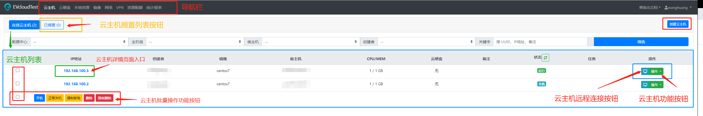
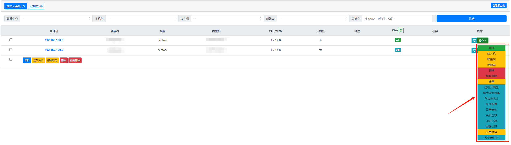
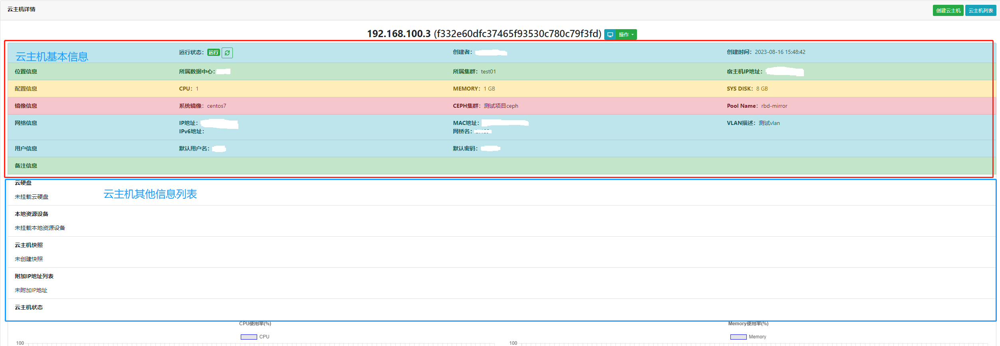
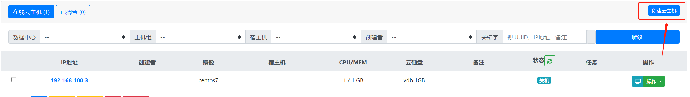
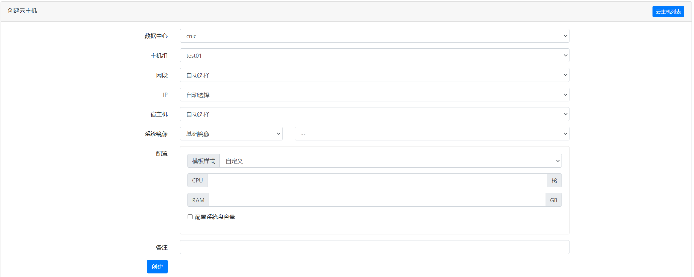

## evcloud功能操作指南
详细说明evcloud所有操作

> 云主机页面功能结构图
> 

> 云主机功能按钮图
> 

> 进入云主机详情页面
> 

> 创建云主机
>
> - 点击 **创建云主机** 按钮
> - **必填项**：数据中心、主机组、配置；**选填项**：网段、IP、宿主机、系统镜像、备注
> - **注意点**：配置样式分两种情况：1. 自己设置CPU和内存 2.根据模板样式选择 \
>   其他注意点:配置系统盘容量，默认是系统设置的大小，可自定义配置
> 
> 

> 开启云主机
> 
> - 在每一条云主机列表中，右侧有 **操作** 的绿色按钮点击
> - 点击 **开机** 按钮，对应云主机状态会更新为 **运行** 状态，如果没有更新可以点击状态旁边的类似旋转的按钮
> - 可参照 **云主机功能按钮图**

> 关闭云主机
> 
> - 在每一条云主机列表中，右侧有 **操作** 的绿色按钮点击
> - 点击 **关机** 按钮，对应云主机状态会更新为 **关机** 状态，如果没有更新可以点击状态旁边的类似旋转的按钮
> - 可参照 **云主机功能按钮图**

> 重启云主机
> 
> - 在每一条云主机列表中，右侧有 **操作** 的绿色按钮点击
> - 点击 **重启** 按钮
> - 可参照 **云主机功能按钮图**

> 硬断电（关机）
> 
> - 在每一条云主机列表中，右侧有 **操作** 的绿色按钮点击
> - 点击 **硬断电** 按钮，如果出现无法关机等情况，可以尝试此操作
> - 可参照 **云主机功能按钮图**

> 删除云主机
> 
> - 在每一条云主机列表中，右侧有 **操作** 的绿色按钮点击
> - 点击 **删除** 按钮，会保留系统镜像
> - 可参照 **云主机功能按钮图**

> 强制删除云主机
> 
> - 在每一条云主机列表中，右侧有 **操作** 的绿色按钮点击
> - 点击 **强制删除** 按钮，会将系统镜像同时删除
> - 可参照 **云主机功能按钮图**

> 挂载云硬盘
> 
> - 第一种 **挂载云硬盘** 操作：
> > - 在每一条云主机列表中，右侧有 **操作** 的绿色按钮点击
> > - 点击 **挂载云硬盘** 按钮，会跳转到云硬盘界面，可选择挂载云硬盘
> > - 可参照 **云主机功能按钮图**
> - 第二种 **挂载云硬盘操作**
> > 在导航栏中点击 **云硬盘** 选项
> > 选择其中一个云硬盘，点击 **挂载** 按钮，跳转到云主机列表页面，选择其中一个云主机并点击**挂载**操作

> 卸载云硬盘
> - 第一种 **卸载云硬盘** 操作：
> > - 点击云主机中的IP，跳转到云主机详情页面，找到云硬盘列表。
> > - 可选择卸载已挂载的云硬盘
> > - 可参照 **云主机功能按钮图**
> - 第二种 **卸载云硬盘** 操作：
> > 在导航栏中点击 **云硬盘** 选项
> > 找到为云主机挂载的硬盘，点击 **卸载** 按钮

> 挂载本地设备
> 
> - 第一种方式：
> > - 在每一条云主机列表中，右侧有 **操作** 的绿色按钮点击
> > - 点击 **挂载本地设备** 按钮，跳转到 **挂载本地设备设备** 页面，选择合适的设备点击 **挂载** 操作
> > - 可参照 **云主机功能按钮图**
> 
> - 第二种方式：
> > - 点击导航栏 **本地资源** 
> > - 选择合适的设备，点击 **挂载** ，跳转到云主机列表，选择合适的云主机， 点击 **挂载**。

> 卸载本地设备
> 
> - 点击云主机列表， 进入云主机详情界面，找到 **本地资源设备** 列表栏，选择想要卸载的设备。

> 重置镜像
> 
>  - 在每一条云主机列表中，右侧有 **操作** 的绿色按钮点击
>  - 点击 **重置镜像** 按钮，跳转到 **重置镜像** 页面，选择合适的镜像点击 **重置** 操作
>  - 注意：重置镜像需要提前将原镜像中的数据保存到本地或其他地方，重置镜像后原数据不保留。

> 创建快照
> 
> - 在每一条云主机列表中，右侧有 **操作** 的绿色按钮点击
> - 点击 **创建快照** 按钮，根据提示操作。
> - 注意：恢复快照，需进入云主机详情界面，找到 **云主机快照**， 点击 **回滚**操作。

> 系统盘扩容
> 
> - 在每一条云主机列表中，右侧有 **操作** 的绿色按钮点击
> - 点击 **系统盘扩容** 按钮，跳转到云主机系统盘扩容页面，输入具体值，点击 **确定** 按钮。

> 附加IP地址
> 
> - 在每一条云主机列表中，右侧有 **操作** 的绿色按钮点击
> - 点击 **附加IP地址** 按钮，跳转到附加IP地址页面，选择IP地址，点击 **附加IP地址** 按钮。

> 搁置云主机
> 
> - 在每一条云主机列表中，右侧有 **操作** 的绿色按钮点击
> - 点击 **搁置** 按钮， 根据提示进一步操作。
> - 注意：查看搁置后的云主机，可点击 **已搁置** 按钮。

> 恢复云主机
> 
> - 点击 **已搁置** 按钮， 选择云主机，点击 **操作** 按钮
> - 选择 **恢复** 按钮操作。

> 动态迁移云主机
> 
> - 在每一条云主机列表中，右侧有 **操作** 的绿色按钮点击
> - 点击 **动态迁移** 按钮， 跳转到动态迁移页面， 选择合适的宿主机，点击 **迁移** 按钮。

> 静态迁移云主机
> 
> - 在每一条云主机列表中，右侧有 **操作** 的绿色按钮点击
> - 点击 **静态迁移** 按钮， 跳转到静态迁移页面， 选择合适的宿主机，点击 **迁移** 按钮。
> - 注意：需在云主机关闭的状态下操作。

[comment]: <> (## API文档)

[comment]: <> (> 交互式<a href="/apidocs/" target="view_window">API文档</a>，可在线调用测试API,当前用户只能)

[comment]: <> (看到符合当前用户权限的API,未登录用户仅可查看部分API,有些API需要超级用户权限,要查看尝试所用API请先登录。)

